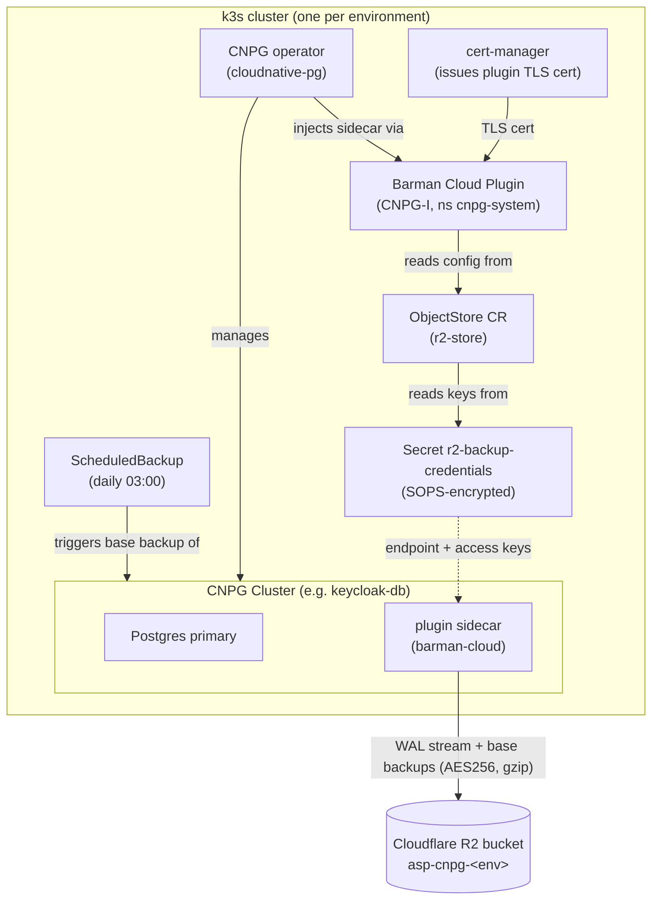
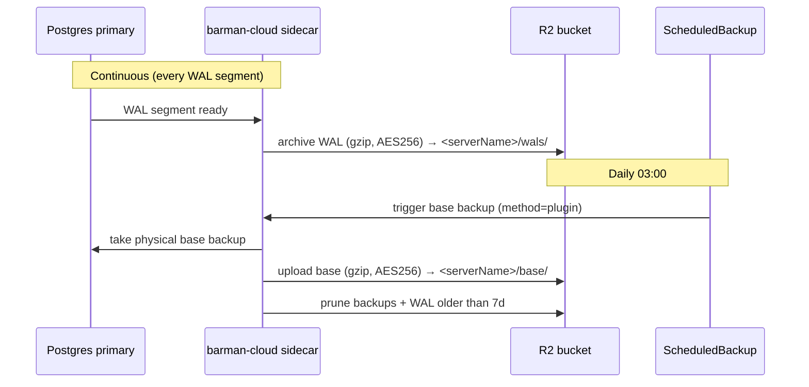
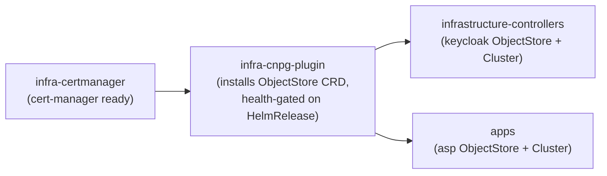

# Database Backups — CNPG → Cloudflare R2

Every CNPG Postgres cluster ships continuous, restore-verified backups to
Cloudflare R2 (S3-compatible object storage). The design gives **point-in-time
recovery (PITR)**: a daily physical base backup plus continuous WAL archiving,
so the database can be restored to any moment within the retention window.

Two clusters are protected:

| Cluster | Namespace | Holds |
|---|---|---|
| `keycloak-db` | `identity` | Keycloak realms, users, sessions |
| `asp-db` | `asp` | Automarket scraper data |

## Components and how they interact



- **cert-manager** — hard dependency of the plugin; mints the TLS cert the plugin
  uses for its gRPC endpoint to the operator.
- **CNPG operator** — manages the Postgres clusters and, when a cluster declares
  the plugin, injects the `barman-cloud` sidecar into each instance pod.
- **Barman Cloud Plugin (CNPG-I)** — installs the `ObjectStore` CRD and performs
  the actual upload/download against R2. Lives in `cnpg-system`.
- **ObjectStore CR (`r2-store`)** — per-namespace config: R2 bucket
  (`destinationPath`), endpoint, credentials ref, compression, AES256 encryption,
  retention (`7d`), and the R2 checksum-compatibility env vars.
- **Secret `r2-backup-credentials`** — SOPS-encrypted R2 access key id + secret.
  One value per environment, present in each namespace that runs a cluster.
- **Cluster `.spec.plugins`** — attaches the cluster to the plugin and marks it
  the WAL archiver; sets `serverName`, the per-cluster prefix inside the bucket.
- **ScheduledBackup** — fires a daily physical base backup via the plugin method.

## Storage layout in R2

One bucket per **environment** (isolation: a staging compromise cannot reach
production backups). Both clusters share an env bucket, separated by `serverName`:

```
asp-cnpg-staging/                 asp-cnpg-production/
├── keycloak-db/   (serverName)   ├── keycloak-db/
│   ├── base/                     │   ├── base/
│   └── wals/                     │   └── wals/
└── asp-db/                       └── asp-db/
    ├── base/                         ├── base/
    └── wals/                         └── wals/
```

- **Credentials**: one R2 API token per env, scoped Object Read & Write to that
  env's bucket only.
- **Encryption**: AES256 server-side on both base data and WAL; gzip compression.
- **Retention**: `7d` — the plugin prunes base backups + WAL older than 7 days.
- **Versioning** enabled on each bucket to guard against accidental delete.

## Backup data flow



WAL archiving + base backups together enable PITR: restore the latest base
backup, then replay WAL up to the chosen target time.

## Cloudflare R2 compatibility note

boto3 ≥ 1.36 sends S3 data-integrity checksums that R2 rejects
(`XAmzContentSHA256Mismatch`) — this breaks both archiving and restore
(upstream `plugin-barman-cloud` issue #411). The fix is baked into every
`ObjectStore` under `instanceSidecarConfiguration.env`:

```yaml
env:
  - name: AWS_REQUEST_CHECKSUM_CALCULATION
    value: when_required
  - name: AWS_RESPONSE_CHECKSUM_VALIDATION
    value: when_required
```

Because of this history, a **restore drill is mandatory** after enabling backups
in an environment — a backup that cannot restore is worthless.

## Flux deployment order

The plugin installs the `ObjectStore` **CRD**; the `ObjectStore` **CRs** live in
other Kustomizations. Flux applies a Kustomization atomically, so a CR sharing a
Kustomization with its own CRD would deadlock (`no matches for kind ObjectStore`).
The CRD provider is therefore isolated and gated:



- `infra-certmanager` → `base/cert-manager` (cert-manager HelmRelease).
- `infra-cnpg-plugin` → `base/cnpg/plugin` (OCI chart `plugin-barman-cloud` from
  `oci://ghcr.io/cloudnative-pg/charts`). `dependsOn: infra-certmanager`,
  `wait: true`, health-gated on the `plugin-barman-cloud` HelmRelease.
- `infrastructure-controllers` and `apps` both `dependsOn: infra-cnpg-plugin`, so
  the CRD always exists before any `ObjectStore` is applied.

The CNPG **operator** install stays in `base/cnpg` (separate from the plugin) so
the already-running operator is never churned by this layering.

## File map

| Concern | Path |
|---|---|
| cert-manager | `infrastructure/controllers/base/cert-manager/` |
| Plugin (OCI HelmRelease + source) | `infrastructure/controllers/base/cnpg/plugin/` |
| CNPG operator | `infrastructure/controllers/base/cnpg/` |
| keycloak backup CRs | `infrastructure/controllers/<env>/keycloak/database/` |
| asp backup CRs | `apps/<env>/asp/` (`objectstore.yaml`, `scheduledbackup.yaml`, `cluster-backup-patch.yaml`, `r2-backup-credentials.enc.yaml`) |
| Flux ordering | `clusters/<env>/infrastructure.yaml`, `clusters/<env>/apps.yaml` |

## Operations

Trigger an on-demand backup (instead of waiting for 03:00):

```sh
kubectl cnpg backup keycloak-db -n identity \
  --method=plugin --plugin-name=barman-cloud.cloudnative-pg.io
```

Check archiving / backup status:

```sh
kubectl -n identity get cluster keycloak-db \
  -o jsonpath='{.status.conditions}'        # ContinuousArchiving=True
kubectl -n identity get scheduledbackup,backup
```

Restore drill (PITR) — recover into a throwaway cluster, verify, tear down:

```yaml
apiVersion: postgresql.cnpg.io/v1
kind: Cluster
metadata:
  name: keycloak-db-restore-test
  namespace: identity
spec:
  instances: 1
  bootstrap:
    recovery:
      source: keycloak-db
      recoveryTarget:
        targetTime: "2026-06-02 02:30:00+00"   # any point within 7d
  externalClusters:
    - name: keycloak-db
      plugin:
        name: barman-cloud.cloudnative-pg.io
        parameters:
          barmanObjectName: r2-store
          serverName: keycloak-db
```

Rotate the R2 token periodically: mint a new scoped token, update the SOPS secret
(`sops -e -i`), commit, then revoke the old token.
